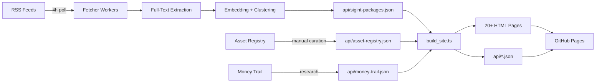

# Architecture

## High-Level Data Flow



---

## Build Pipeline Stages

| Stage | Script | Input | Output |
|-------|--------|-------|--------|
| **1. Ingest** | External | RSS feeds | `stories_raw.json` |
| **2. Extract** | External | Raw HTML | Full text + metadata |
| **3. Cluster** | External | Embeddings | `sigint-packages.json` |
| **4. Curate** | Manual | Research | `asset-registry.json`, `money-trail.json` |
| **5. Build** | `scripts/build_site.ts` | All `api/*.json` | `*.html` + `api/*.json` |
| **6. Deploy** | GitHub Actions | `main` branch push | `gh-pages` branch |

---

## Directory Layout

```
botwave-bomba/
├── .github/
│   ├── workflows/          # CI/CD pipelines
│   │   ├── ci.yml          # lint → test → build → deploy
│   │   └── dependabot-auto-merge.yml
│   ├── dependabot.yml      # Dependency automation
│   ├── ISSUE_TEMPLATE/     # Bug, feature, asset addition
│   ├── PULL_REQUEST_TEMPLATE.md
│   ├── CODEOWNERS
│   └── FUNDING.yml
├── api/                    # Static JSON data (served at runtime)
│   ├── sigint-packages.json
│   ├── asset-registry.json
│   ├── money-trail.json
│   ├── feed_sources.json
│   ├── radar.json
│   ├── black-sites.json
│   ├── spool.json
│   ├── numbers-station_latest.json
│   └── errata.json
├── assets/
│   ├── css/
│   │   ├── main.css        # Design system, variables, components
│   │   ├── radar.css       # Canvas styles
│   │   └── print.css       # Print/PDF styles (Numbers Station)
│   ├── js/
│   │   ├── main.js         # Theme toggle, Dead Drop, nav
│   │   ├── radar.js        # Canvas renderer
│   │   └── spool.js        # Table interactions
│   ├── img/
│   └── manifest.json       # PWA manifest
├── scripts/
│   ├── build_site.ts       # Main generator (~700 lines)
│   ├── dev_server.ts       # Hot reload (Bun.serve)
│   └── lib/
│       ├── data.ts         # Types, loaders, utils
│       ├── alignment.ts    # Sector classification, routing
│       ├── black-site.ts   # Black site detection
│       ├── radar.ts        # Signal density scan
│       ├── spool.ts        # Temporal evolution
│       ├── numbers-station.ts # Daily broadcast
│       └── sigint-card.ts  # UI card rendering
├── docs/                   # MkDocs documentation
│   ├── mkdocs.yml
│   └── docs/
│       ├── index.md
│       ├── getting-started/
│       ├── methodology/
│       ├── api/
│       ├── algorithms/
│       ├── contributing/
│       └── security/
├── *.html                  # 20+ generated pages (GitHub Pages root)
├── _headers                # CSP, cache-control for GitHub Pages
├── _redirects              # Legacy URL redirects
├── package.json
├── tsconfig.json
├── ISA.md                  # Architecture contract
├── CONTRIBUTING.md
├── SECURITY.md
├── CODE_OF_CONDUCT.md
├── CHANGELOG.md
├── LICENSE
└── README.md
```

---

## Design System

### CSS Variables (in `assets/css/main.css`)

```css
:root {
  --bg: #fafafa;
  --bg-elevated: #ffffff;
  --text: #1a1a2e;
  --text-muted: #6b7280;
  --border: #e5e7eb;
  --primary: #3b0764;        /* Indigo */
  --primary-hover: #2d004d;
  --accent: #e74c3c;         /* Alert red */
  --western: #3b82f6;        /* Blue */
  --non-aligned: #f59e0b;    /* Amber */
  --adversarial: #ef4444;    /* Red */
  --other: #9ca3af;          /* Gray */
  --radius: 6px;
  --shadow: 0 1px 3px rgba(0,0,0,0.1);
  --shadow-lg: 0 4px 12px rgba(0,0,0,0.15);
  --font-sans: system-ui, -apple-system, BlinkMacSystemFont, "Segoe UI", Roboto, sans-serif;
  --font-mono: "DM Mono", "Fira Code", monospace;
  --transition: 150ms ease;
}

@media (prefers-color-scheme: dark) {
  :root {
    --bg: #0f0f1a;
    --bg-elevated: #1a1a2e;
    --text: #e8e8f0;
    --text-muted: #9ca3af;
    --border: #2d2d44;
    --primary: #a78bfa;
    --primary-hover: #c4b5fd;
    --shadow: 0 1px 3px rgba(0,0,0,0.3);
    --shadow-lg: 0 4px 12px rgba(0,0,0,0.4);
  }
}
```

### Alignment Color Palette

| Alignment | CSS Var | Light | Dark | Meaning |
|-----------|---------|-------|------|---------|
| Western | `--western` | #3b82f6 | #60a5fa | US/EU/NATO-aligned outlets |
| Non-Aligned | `--non-aligned` | #f59e0b | #fbbf24 | Global South, independent |
| Adversarial | `--adversarial` | #ef4444 | #f87171 | State media of rival powers |
| Other | `--other` | #9ca3af | #9ca3af | Unclassified |

---

## Security Headers (`_headers`)

```
/*
  X-Frame-Options: DENY
  X-Content-Type-Options: nosniff
  Referrer-Policy: strict-origin-when-cross-origin
  Permissions-Policy: camera=(), microphone=(), geolocation=()

/numbers-station.html
  Content-Security-Policy: default-src 'self'; style-src 'self' 'unsafe-inline'; script-src 'none'; img-src 'self' data:; frame-ancestors 'none'
  Cache-Control: max-age=86400, must-revalidate
  X-Robots-Tag: noindex, nofollow

/api/*
  Cache-Control: max-age=3600, must-revalidate
  Access-Control-Allow-Origin: *

/assets/*
  Cache-Control: max-age=31536000, immutable
```

---

## Deterministic Build

- **No timestamps in output** — `build_site.ts` uses `buildDate` from `package.json` version or git tag
- **Sorted keys** — `JSON.stringify(obj, null, 2)` with `Object.keys().sort()`
- **Stable sorting** — All arrays sorted by deterministic keys (id, date, count desc)
- **No randomness** — No `Math.random()`, no `Date.now()` in render paths

```typescript
// Build stamp (reproducible)
const BUILD_STAMP = process.env.GITHUB_SHA?.slice(0, 7) || 'local-' + require('./package.json').version;
```

---

## PWA Support

`assets/manifest.json`:
```json
{
  "name": "NISA Signal Intelligence",
  "short_name": "NISA",
  "start_url": "/",
  "display": "standalone",
  "background_color": "#0f0f1a",
  "theme_color": "#3b0764",
  "icons": [
    { "src": "/assets/img/icon-192.png", "sizes": "192x192", "type": "image/png" },
    { "src": "/assets/img/icon-512.png", "sizes": "512x512", "type": "image/png" }
  ]
}
```

---

## Performance Budgets

| Metric | Budget |
|--------|--------|
| Initial HTML (gz) | < 50 KB |
| CSS (gz) | < 30 KB |
| JS (gz) | < 40 KB |
| Largest JSON API | < 500 KB |
| LCP (lab) | < 2.5s |
| CLS | < 0.1 |

---

## Related

- [Quickstart](quickstart.md)
- [Data Pipeline](data-pipeline.md)
- [CI/CD Pipeline](../contributing/release-process.md)